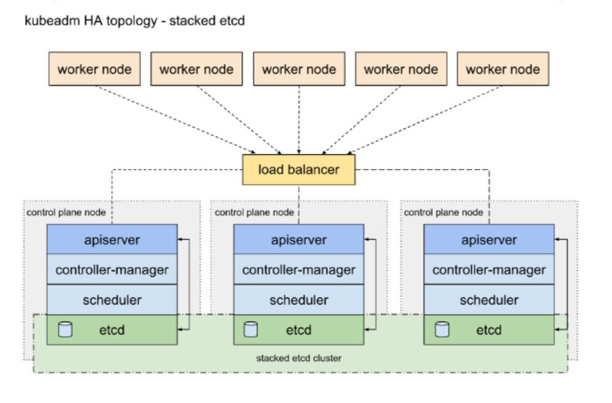
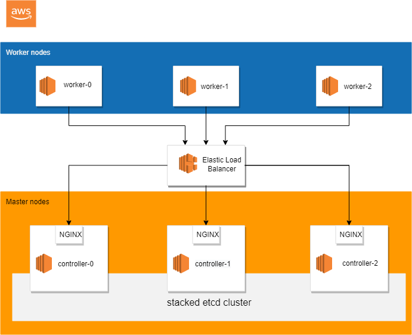

# aws-kubernetes-high-availability

Based on [AWS open5gs K8S High Availability](https://awstip.com/aws-open5gs-k8s-high-availability-part-1-9d41f47d9d7c)

* Self-managed Kubernetes High Availability in AWS
* This guide is not for people looking for a fully automated command to bring up a Kubernetes cluster
* AWS EC2 use here for nodes, you can use EKS by following this tutorial https://aws.amazon.com/blogs/opensource/open-source-mobile-core-network-implementation-on-amazon-elastic-kubernetes-service/
* Calico, Containerd, Kubernetes v1.22.x, ROOK, CEPH, HELM, Istio, Open5Gs, Rancher, nginx
* The results of this tutorial should not be viewed as production ready, and may receive limited support from the community, but don’t let that stop you from learning!

## Topology

source : kubernetes.io

## Topology GCP

## Labs

This tutorial assumes you have access to the [Amazon Web
Services](https://aws.amazon.com). While AWS is used for basic infrastructure requirements the lessons learned in this tutorial can be applied to other platforms.

* [Prerequisites](docs/01-prerequisites.md)
* [Part 1 - AWS login and Networking](docs/02-part-01.md)
* [Part 2 - Provisioning Compute Resources](docs/03-part-02.md)
* [Part 3 - Install Kubernetes on All Controller node](docs/04-part-03.md)
* [Part 4 - Enable HTTP Health Checks](docs/05-part-04.md)
* [Part 5 - Install Kubernetes and enable sctp on All Worker nodes](docs/06-part-05.md)
* [Part 6 - Bootstrapping the Kubernetes Control Plane](docs/07-part-06.md)
* [Part 7 - Bootstrapping the Kubernetes Worker Nodes](docs/08-part-07.md)
* [Part 8 - Istio, helm and Rancher](docs/09-part-08.md)
* [Part 9 - Rook Ceph](docs/10-part-09.md)
* [Part 10 - Getting access to Rancher](docs/11-part-10.md)
* [Part 11 - Getting access to Grafana](docs/12-part-11.md)
* [Part 12 - Getting access to Istio Kiali Dashboard](docs/13-part-12.md)
* [Part 13 - Testing create PVC & POD](docs/14-part-13.md)

References:

https://github.com/slawekzachcial/kubernetes-the-hard-way-aws

https://assyafii.com/docs/install-kubernetes-cluster-multi-master-ha/

https://assyafii.com/docs/deploy-storage-cluster-rook-with-ceph-in-kubernetes/

https://rook.io/docs/rook/v1.7/
